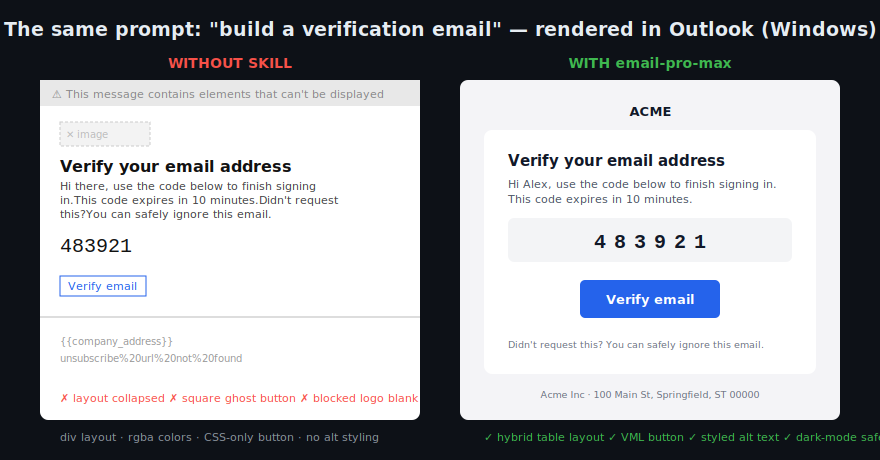

# email-pro-max

**Design intelligence for HTML email. Make Claude write email that renders perfectly in Outlook, Gmail, Apple Mail — all of them.**



Ask an AI for an email template and you'll get modern CSS that shatters in
Outlook, gets clipped by Gmail, and turns illegible in dark mode. Email clients
are not browsers — Outlook still renders with **Microsoft Word's engine**, and
no amount of general web knowledge fixes that.

This skill teaches Claude the real rules: table layout, bulletproof VML buttons,
the hybrid responsive pattern, dark-mode survival, the Gmail 102KB clip, and a
client-support matrix for 25+ clients — so the first draft renders correctly
everywhere instead of only in your browser preview.

## Install

```sh
# Claude Code
git clone https://github.com/jayesh-bansal/email-pro-max.git ~/.claude/skills/email-pro-max
```

That's it. Next time you ask Claude for an email, the skill activates
automatically.

## What's inside

| File | What it gives Claude |
|------|---------------------|
| `SKILL.md` | The 10 non-negotiable rules + build workflow |
| `data/client-support.md` | CSS support matrix across Apple Mail, Gmail, Word-engine Outlook, Outlook.com, Yahoo + client-specific landmines |
| `data/patterns.md` | Copy-paste bulletproof patterns: hybrid layout, VML buttons, stacking columns, dark-mode kit, preheader, compliance footer |
| `data/checklist.md` | Pre-send QA: markup checks Claude runs + external checks you run |
| `data/templates/` | Production-ready starting points (verification/OTP, more coming) |

## Before / after

**Without the skill:** `div`-based layout, `rgba()` colors, CSS-only button →
broken layout in Outlook, invisible CTA with images blocked, harsh inverted
colors in Gmail dark mode.

**With the skill:** hybrid ghost-table layout, VML-backed button, styled alt
text, `data-ogsc` dark-mode rules → pixel-correct in Word-engine Outlook,
graceful in forced dark mode, readable with images blocked.

## Why email is like this (the 30-second version)

- Outlook for Windows (classic) renders HTML with Word — no flexbox, no
  `max-width`, no `border-radius`, no background images without VML.
- Gmail clips messages over 102KB and drops your whole `<style>` block if one
  rule errors.
- Gmail/Outlook mobile **force-invert** light emails in dark mode, ignoring
  your media queries.
- Images are blocked by default in Outlook — your email must work as styled
  text first.

Every pattern in this skill exists because of one of those facts.

## Roadmap

- [ ] Newsletter / digest template
- [ ] Receipt / invoice template
- [ ] Cart-abandonment template
- [ ] Per-ESP merge-tag dialect notes (SendGrid, Postmark, Mailchimp, Resend, SES)
- [ ] AMP for Email guidance

## License

MIT
